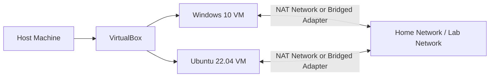

# Home IT Lab: Windows, Ubuntu, VirtualBox, and Network Troubleshooting

I built this lab to practice the kind of troubleshooting I expect to use in an entry-level IT or cybersecurity role: setting up virtual machines, managing users, recovering from mistakes, and fixing basic network connectivity issues.

The lab uses Windows 10 and Ubuntu 22.04 virtual machines in VirtualBox. I documented the setup, the issues I ran into, and the steps I used to recover from them.

## What This Shows

- Built and managed Windows and Linux virtual machines.
- Created local users and tested admin, standard user, root, and sudo permissions.
- Used VirtualBox snapshots to test recovery workflows.
- Troubleshot a Linux sudo access issue after a snapshot restore.
- Compared NAT and Bridged Adapter networking for VM connectivity.
- Documented the lab with screenshots instead of only listing tools.

## Lab Setup

| Component | Purpose |
| --- | --- |
| VirtualBox | Ran and managed the virtual machines |
| Windows 10 | Practiced local user administration |
| Ubuntu 22.04 | Practiced Linux recovery, terminal use, and sudo permissions |
| NAT / Bridged Adapter | Tested different VM network configurations |

## Network Layout

## Troubleshooting Notes

### Snapshot Restore Removed Sudo Access

After restoring an Ubuntu snapshot, the user I expected to use no longer had the access I needed. I could not run normal administrative commands with sudo.

**What I did:** Booted into Ubuntu advanced/recovery mode, opened a root shell, and restored sudo privileges to a local user.

Evidence:

### VM Network Connectivity Failed

The Windows and Ubuntu VMs could not reliably reach each other during connectivity testing.

**What I did:** Checked the VirtualBox network settings and switched from NAT to Bridged Adapter mode so both VMs could communicate on the same network. A NAT Network would also work for an isolated VM-to-VM lab.

Evidence:

## Lab Evidence

| Task | Screenshot |
| --- | --- |
| Windows VM running |  |
| Windows and Ubuntu lab |  |
| Windows user creation |  |
| Ubuntu terminal |  |
| Snapshot management |  |

## Lessons Learned

- Snapshots are useful, but they need to be checked before relying on them.
- Every VM should have at least one known working administrator or sudo-enabled account.
- The VirtualBox network mode should match the goal of the lab:
  - NAT for simple internet access.
  - NAT Network for isolated VM-to-VM communication.
  - Bridged Adapter for placing VMs on the same network as the host.
- Screenshots help turn a basic lab into proof of hands-on practice.

## Next Steps

- Add exact IP addresses, VM specs, and adapter settings used during testing.
- Build an Active Directory lab with Windows Server and a Windows client.
- Add SSH, firewall rule testing, basic logging, and vulnerability scanning labs.
